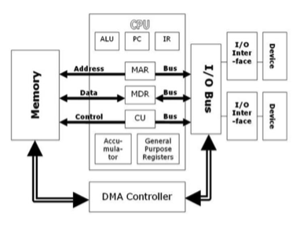
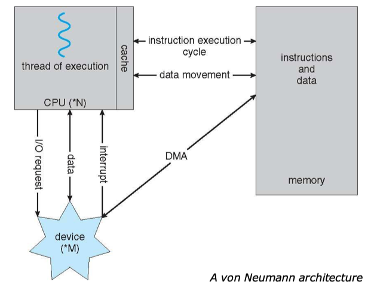
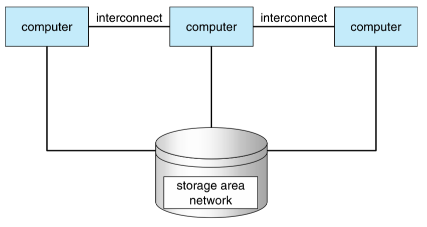
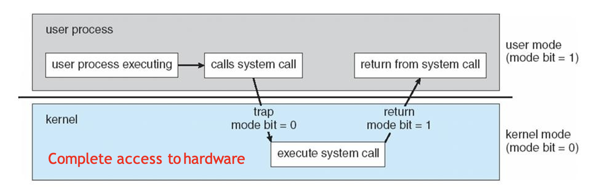
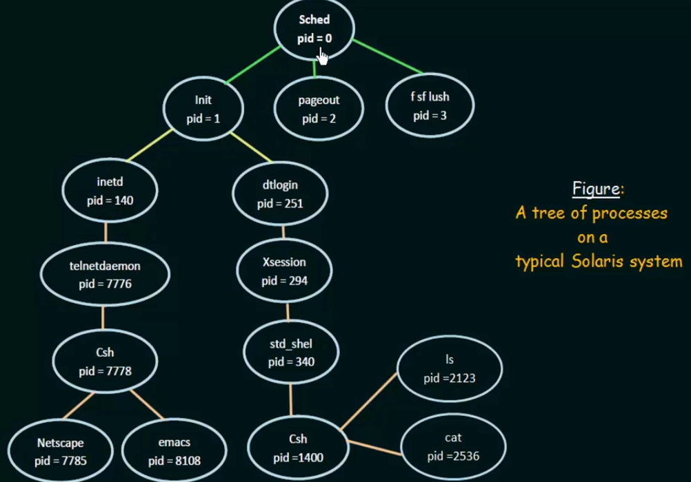

<h1>Todo list</h1>

<h3>Assignment list</h3>

- [ ] Assignment 1 due: 10-9
- [ ] Assignment 2 due:
- [ ] Assignment 3 due:
- [ ] Assignment 4 due:
- [ ] Assignment 5 due:

<h3>Learning Process</h3>

- [ ] Chapter 1
- [ ] NJU video P1-P4

<h3>Today<h3>

<h1>CSC3150 Note</h1>

<h3>Chapter 1</h3>

1. 把操作系统当作是kernel，一个一直运行在计算机上的程序
2. bootstrap program: 位于计算机固件(firmware), 用来初始化所有硬件设备并启动操作系统
   1. ROM: read-only memory, 一种只读存储器，一旦写入就不能修改
   2. EPROM: erasable programmable ROM, 可擦写可编程ROM
3. local buffer: 位于I/O设备和CPU之间，用来缓存数据
4. interrupt: 用来处理I/O设备的一种机制，当I/O设备准备好数据时，会发送一个中断信号给CPU，CPU会暂停当前的工作，转而去处理I/O设备的数据
5. types of interrupt:
   1. polling interrupt: CPU不断地去轮询I/O设备，看是否有数据准备好了
   2. vectored interrupt: I/O设备准备好数据后，会发送一个中断信号给CPU，CPU会根据中断号从中断向量表中找到对应的中断处理程序的地址，然后跳转到该地址去执行中断处理程序
6. I/O structure:
   1. synchronous I/O: CPU会等待I/O设备完成数据的读写，然后再去做其他的事情。只允许同时进行一个I/O操作。
   2. asynchronous I/O: CPU不会等待I/O设备完成数据的读写，而是直接去做其他的事情，当I/O设备完成数据的读写后，会发送一个中断信号给CPU，CPU会暂停当前的工作，转而去处理I/O设备的数据
7. Storage structure: registers -> cache -> main memory -> magnetic disk -> optical disk -> magnetic tape
   1. main memory: 用来存储程序和数据，是易失性的，断电后数据会丢失， 也叫做RAM(random access memory)
   2. secondary storage: 用来存储程序和数据，是非易失性的，断电后数据不会丢失，
   3. cache: 位于CPU和主存之间，用来缓存主存中的数据，是易失性的，断电后数据会丢失
   4. magnetic disk: 位于主存和磁带之间，用来存储程序和数据，是非易失性的，断电后数据不会丢失
   5. optical disk: 位于磁盘和磁带之间，用来存储程序和数据，是非易失性的，断电后数据不会丢失
   6. magnetic tape: 用来存储程序和数据，是非易失性的，断电后数据不会丢失
   7. Direct Memory Access Structure: 
   8. Multiprocessing system (parallel system, multicore system): 一个计算机系统中有多个CPU，每个CPU都有自己的寄存器和cache，但是共享主存和I/O设备
   9. Clustered system: 一个计算机系统中有多个计算机，每个计算机都有自己的寄存器、cache、主存和I/O设备，但是共享磁盘
8. Operating system structure
    1. 多通道程序能力：提高CPU利用率
    2. job pool: 用来存放所有的作业，当CPU空闲时，从job pool中取出一个作业，放到内存中去执行
    3. time sharing: 分时操作系统允许许多⽤户同时共享⼀台计算机，系统在多用户间快速切换
    4. job scheduling: 从job pool中取出一个作业，放到内存中去执行
    5. CPU scheduling: 从内存中取出一个作业，放到CPU中去执行
9. OS operations:
   1.  trap: 软件生成的中断，或源于出错，或源于用户程序的请求
   2.  区分os代码和用户代码：确保os正确运行，确保用户程序不会破坏os
   3.  
   4.  减少模式切换：损耗性能
   5.  特权指令：只能在内核态下执行的指令，如果在用户模式下使用，硬件会视为非法指令
   6.  定时器：防止用户程序陷入死循环，防止用户程序长时间占用CPU；到达固定时间后，硬件会自动产生一个中断信号，CPU会暂停当前的工作，转而去处理中断信号
10. 进程管理：
    1.  进程：正在执行的程序的实例，是一个动态的概念，是一个程序在一个数据集上的一次执行过程
    2.  分配资源的工作单元
    3.  程序：主动实体，进程：被动实体
    4.  进程状态：new -> ready -> running -> waiting -> ready -> terminated
        1.  new: 进程正在被创建
        2.  ready: 进程已经被创建，但是还没有被调度到CPU上去执行
        3.  running: 进程正在被CPU执行
        4.  waiting: 进程正在等待I/O设备的数据
        5.  ready: 进程正在等待I/O设备的数据，当I/O设备准备好数据后，会发送一个中断信号给CPU，CPU会暂停当前的工作，转而去处理I/O设备的数据
        6.  terminated: 进程已经执行完毕
    5. **Process Creation:**
       1. A process may create several new processes, via a create-process system call, during the course of execution.
       2. Tree of processes: 
       3. *Q* 为什么会有processes tree: 为了方便管理进程，方便资源的分配和回收；进程树以树的结构来表示，既能够简化进程间的关系，也方便了操作系统和应用程序对进程进行分析和管理。
11. 存储管理：
12. 文件管理：